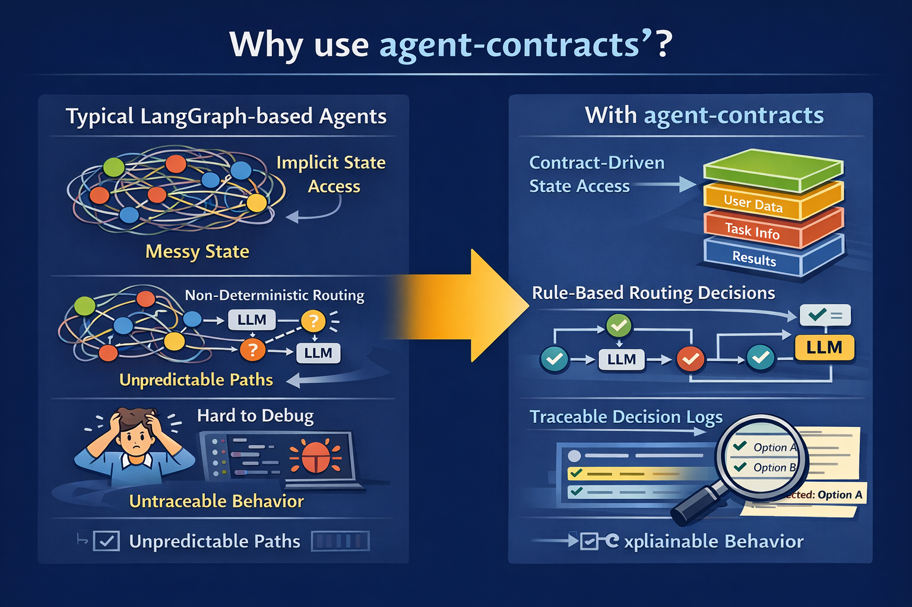
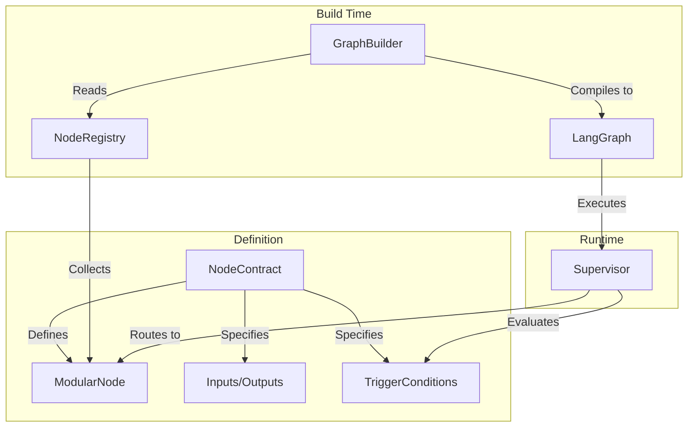

# agent-contracts

[](https://pypi.org/project/agent-contracts/)
[](https://pypi.org/project/agent-contracts/)
[](https://www.python.org/downloads/)
[](https://opensource.org/licenses/MPL-2.0)
[](https://github.com/yatarousan0227/agent-contracts/actions/workflows/ci.yml)

[](https://yatarousan0227.github.io/agent-contracts/)

English | [日本語](README.ja.md)

**A modular, contract-driven node architecture for building scalable LangGraph agents.**

---

### The Problem
Building multi-agent systems with raw graphs is powerful but scales poorly. As you add nodes, manual wiring (`graph.add_edge`) becomes unmanageable, routing logic gets scattered across conditional edges, and it becomes impossible to see how data flows through the system.

### Why agent-contracts?
To build maintainable agent systems, we need to decouple **node behavior** (what it does) from **graph topology** (how it connects). We need a way to define strict interfaces without sacrificing the flexibility of LLM-based routing.

### The Solution
`agent-contracts` brings **Contract-Driven Development** to LangGraph.
Instead of manually wiring edges, you define a `NodeContract` for each agent—specifying its inputs, outputs, and when it should run. The framework then **automatically compiles** these contracts into a fully functional LangGraph, handling the complex routing, type-checking, and state management for you.


---

## 🎯 Target Audience

This library is designed for:
- **Developers building complex multi-agent systems** who need structure and maintainability.
- **Teams** where different members work on different agent modules.
- **Production applications** requiring strict interface definitions (Inputs/Outputs) and type safety.

*It is NOT for: Simple, linear chatbots or single-agent prototypes where raw LangChain/LangGraph suffices.*

---

## 💡 Use Cases

- **Complex Routing Logic**: Manage dozens of agents where routing depends on a mix of rules (e.g., "if variable X is set") and LLM decisions (e.g., "if the user intends to buy").
- **Modular Agent Development**: Isolate agent logic. A developer can write a "Search Agent" defining only its contract, without knowing the layout of the entire graph.
- **Hybrid Supervisor**: Implement a supervisor that uses strict business rules first, then falls back to an LLM for ambiguous cases—out of the box.

---

## 🆚 Comparison

| Feature | Vanilla LangGraph | agent-contracts |
|---------|-------------------|-----------------|
| **Wiring** | Manual `add_edge` & `add_conditional_edges` | **Automatic** based on Contracts |
| **Routing** | Custom logic inside conditional functions | **Declarative** `TriggerConditions` (Rule + LLM) |
| **State Access** | Unsafe dict access (`state["key"]`) | **Type-safe** `StateAccessor` pattern |
| **Scalability** | Hard to maintain as graph grows | **Modular**, nodes are self-contained |
| **Observability** | Standard Tracing | **Enhanced**, tracks *why* a node was picked |

---

## 🏗️ Architecture



1. **Define**: You create a Node with a **Contract** (I/O & Triggers).
2. **Register**: You register the node to the **Registry**.
3. **Build**: The **GraphBuilder** compiles the registry into a executable LangGraph.
4. **Run**: The **Supervisor** dynamically routes traffic based on the contracts.

---

## 🚀 Quick Start

### 1. Hello World (Minimal)

Define a simple node that just returns a value.

```python
from agent_contracts import ModularNode, NodeContract, NodeInputs, NodeOutputs
from agent_contracts import get_node_registry, build_graph_from_registry

# 1. Define a Node
class HelloNode(ModularNode):
    CONTRACT = NodeContract(
        name="hello",
        writes=["response"],
        trigger_conditions=[{"priority": 100}]  # Always trigger first
    )

    async def execute(self, inputs: NodeInputs, config=None) -> NodeOutputs:
        return NodeOutputs(response={"message": "Hello World!"})

# 2. Register & Build
registry = get_node_registry()
registry.register(HelloNode)

graph = build_graph_from_registry(registry=registry, supervisors=["main"])
compiled = graph.compile()

# 3. Run
print(await compiled.ainvoke({"input": "start"}))
```

### 2. Practical Example (Routing)

A more realistic setup with a rule-based trigger and an LLM-based trigger.

```python
from agent_contracts import ModularNode, NodeContract, TriggerCondition

# Node A: Runs when user asks for "weather" (LLM semantic match)
class WeatherNode(ModularNode):
    CONTRACT = NodeContract(
        name="weather_agent",
        requires_llm=True,
        trigger_conditions=[
            TriggerCondition(
                llm_hint="User is asking about the weather forecast",
                priority=10
            )
        ]
    )
    # ... implementation ...

# Node B: Runs when a strict flag is present (Rule match)
class UrgentNode(ModularNode):
    CONTRACT = NodeContract(
        name="urgent_agent",
        trigger_conditions=[
            TriggerCondition(
                when={"request.priority": "high"},
                priority=20  # Checked BEFORE LLM
            )
        ]
    )
    # ... implementation ...
```

---

## ✨ Key Features

- **📝 Contract-Driven Design**: Nodes declare their I/O, dependencies, and trigger conditions through `NodeContract`.
- **🔧 Registry-Based Architecture**: Auto-build LangGraph from registered nodes without manual wiring.
- **🧠 LLM-Driven Supervisor**: Intelligent routing that combines deterministic rules with LLM reasoning.
- **📊 Typed State Management**: Pydantic-based state slices with strict validation.
- **🔒 StateAccessor**: Type-safe, immutable state access with IDE autocompletion.
- **🔄 Unified Runtime**: Execution engine with valid hooks, session management, and streaming (SSE) support.
- **⚙️ Configuration**: Externalize settings via YAML with Pydantic validation.

---

## 🏗️ Core Concepts

### NodeContract
The contract is the source of truth for a node.

```python
NodeContract(
    name="my_node",
    description="Calculates mortgage payments",
    reads=["user_profile", "loan_data"],
    writes=["payment_schedule"],
    requires_llm=True,                 # Whether LLM is required
    supervisor="main",                 # Which supervisor manages this node
    trigger_conditions=[
        TriggerCondition(llm_hint="User asks about monthly payments")
    ]
)
```

### GenericSupervisor
The supervisor handles the control flow:
1.  **Strict Rules**: Checks high-priority `when` conditions.
2.  **LLM Decision**: If no strict rules match, asks the LLM using `llm_hint`s.
3.  **Fallback**: Default behavior if undecided.

### InteractiveNode
For conversational agents, you can extend `InteractiveNode`, which provides a structured way to handle turns, generate questions, and process answers.

```python
from agent_contracts import InteractiveNode

class InterviewNode(InteractiveNode):
    CONTRACT = NodeContract(...)
    
    def prepare_context(self, inputs):
        """Extract context from inputs."""
        return {"interview_state": inputs.get_slice("interview")}
    
    def check_completion(self, context, inputs):
        """Check if interview is complete."""
        return context["interview_state"].get("complete", False)
    
    async def process_answer(self, context, inputs):
        """Process user's answer."""
        # Handle the answer logic
        return True
    
    async def generate_question(self, context, inputs):
        """Generate next question."""
        return NodeOutputs(response={"question": "..."})
```

### State Accessor
Avoid stringly-typed state access. `StateAccessor` provides a safe way to read and write state slices.

```python
from agent_contracts import Internal, reset_response

# Bad
user_id = state["profile"]["id"]

# Good (agent-contracts)
user_id = Internal.user_id.get(state)

# Writing (returns new state)
state = Internal.turn_count.set(state, 5)
state = reset_response(state)
```

---

## 🔄 Runtime Layer

For production applications, use the Runtime Layer for unified execution, lifecycle hooks, and streaming.

### AgentRuntime
Standard request/response execution.

```python
from agent_contracts import AgentRuntime, RequestContext, InMemorySessionStore

runtime = AgentRuntime(
    graph=compiled_graph,
    session_store=InMemorySessionStore(),
)

result = await runtime.execute(RequestContext(
    session_id="abc123",
    action="answer",
    message="I like casual style",
    resume_session=True, # Loads state from store
))

print(result.response_type)  # "interview", "proposals", etc.
print(result.response_data)  # Response payload
```

### StreamingRuntime (SSE)
Supports Server-Sent Events (SSE) streaming, yielding events as each node executes.

```python
from agent_contracts.runtime import StreamingRuntime

runtime = (
    StreamingRuntime()
    .add_node("search", search_node, "Searching...")
    .add_node("stylist", stylist_node, "Generating recommendations...")
)

async for event in runtime.stream(request):
    yield event.to_sse()
```

### Custom Hooks & Session Store
Implement protocols to customize behavior.

```python
from agent_contracts import RuntimeHooks, SessionStore

class MyHooks(RuntimeHooks):
    async def prepare_state(self, state, request):
        # Normalize or enrich state before execution
        return state
    
    async def after_execution(self, state, result):
        # Persist session, log, etc.
        pass
```

---

## 📦 Installation

```bash
pip install agent-contracts

# or from source
pip install git+https://github.com/yatarousan0227/agent-contracts.git
```

### Requirements
- Python 3.11+
- LangGraph >= 0.2.0
- LangChain Core >= 0.3.0
- Pydantic >= 2.0.0

---

## ⚙️ Configuration

Manage agent behavior without changing code.

```yaml
# agent_config.yaml
supervisor:
    max_iterations: 10
    model_name: "gpt-4o"

interview:
    max_questions: 5
```

```python
from agent_contracts.config import load_config
config = load_config("agent_config.yaml")
```

---

## 🔍 Observability (LangSmith)

`agent-contracts` is fully integrated with [LangSmith](https://smith.langchain.com/) for deep tracing.

- **See the reasoning**: Why did the Supervisor pick Node A over Node B?
- **Track usage**: How many times did the loop iterate?

LangChain API keys must be set:

```bash
export LANGCHAIN_TRACING_V2=true
export LANGCHAIN_API_KEY="..."
```

---

## 🏗️ Architecture Visualization

Generate professional documentation from your code.

```python
from agent_contracts import ContractVisualizer
visualizer = ContractVisualizer(registry, graph=compiled)
doc = visualizer.generate_architecture_doc()
```

### Generated Sections

| Section | Description |
|---------|-------------|
| **📦 State Slices** | All slices with readers/writers + ER diagram |
| **🔗 LangGraph Node Flow** | Mermaid visualization of the compiled LangGraph |
| **🎯 System Hierarchy** | Supervisor-Node structure with Mermaid flowchart |
| **🔀 Data Flow** | Node dependencies via shared slices |
| **⚡ Trigger Hierarchy** | Priority-ordered triggers (🔴 high → 🟢 low) |
| **📚 Nodes Reference** | Complete node details table |

You can also generate sections individually:

```python
print(visualizer.generate_langgraph_flow())
print(visualizer.generate_state_slices_section())
```

See [ARCHITECTURE_SAMPLE.md](docs/ARCHITECTURE_SAMPLE.md) for example output.

---

## 📚 API Reference

### Main Exports

| Export | Description |
|--------|-------------|
| `ModularNode` | Base class for all nodes |
| `InteractiveNode` | Base class for conversational nodes |
| `NodeContract` | Node I/O contract definition |
| `TriggerCondition` | Trigger condition for routing |
| `NodeInputs` / `NodeOutputs` | Typed I/O containers |
| `NodeRegistry` | Node registration and discovery |
| `GenericSupervisor` | LLM-driven routing supervisor |
| `GraphBuilder` | Automatic LangGraph construction |
| `BaseAgentState` | Base state class with slices |
| `ContractVisualizer` | Architecture document generator |

### Runtime Layer

| Export | Description |
|--------|-------------|
| `AgentRuntime` | Unified execution engine with lifecycle hooks |
| `StreamingRuntime` | Node-by-node streaming for SSE |
| `RequestContext` | Execution request container |
| `ExecutionResult` | Execution result with response |
| `RuntimeHooks` | Protocol for customization hooks |
| `SessionStore` | Protocol for session persistence |

---

## 🤝 Contributing

Contributions are welcome! Please feel free to submit a Pull Request.

---

## 📄 License

This project is licensed under the Mozilla Public License 2.0 (MPL-2.0) - see the [LICENSE](LICENSE) file for details.

---

## 🔗 Links

- [GitHub Repository](https://github.com/yatarousan0227/agent-contracts)
- [LangGraph Documentation](https://langchain-ai.github.io/langgraph/)
