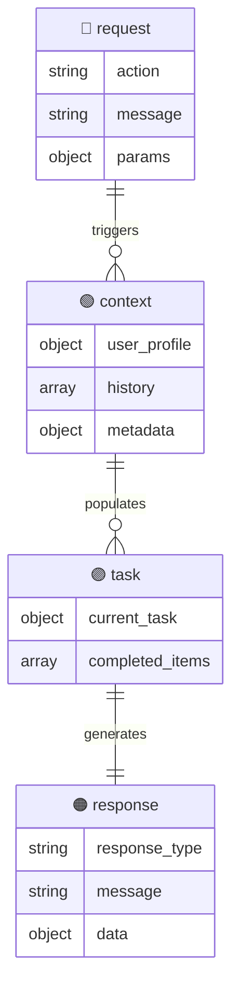
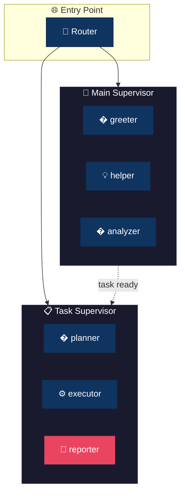
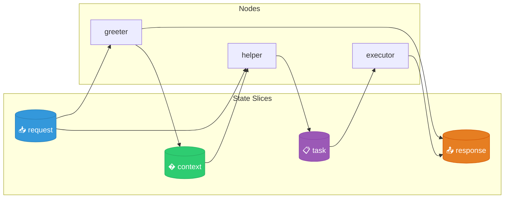
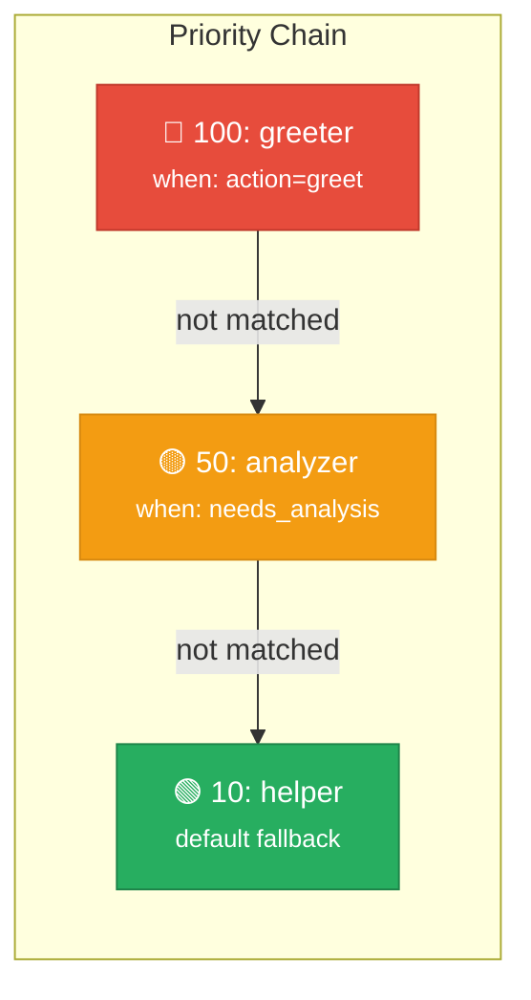

# 🏗️ Agent Architecture

> Auto-generated from `NodeRegistry` contracts

---

## 📦 State Slices

State is organized into isolated **slices** for separation of concerns.

📋 Slice Details

| Slice | Purpose | Key Fields |
|:------|:--------|:-----------|
| `request` | User input | `action`, `message`, `params` |
| `context` | Session context | `user_profile`, `history`, `metadata` |
| `task` | Task state | `current_task`, `completed_items` |
| `response` | API Response | `response_type`, `message`, `data` |

---

## 🎯 System Hierarchy

---

## 🔀 Data Flow

> Arrows show which slices nodes **read** and **write**

---

## ⚡ Trigger Hierarchy

> Nodes are evaluated by **priority** (highest first)

### 🎯 Main Supervisor

| Priority | Node | Condition | Hint |
|:--------:|:-----|:----------|:-----|
| 🔴 **100** | `greeter` | `request.action == "greet"` | Handle greeting |
| 🟡 **50** | `analyzer` | `context.needs_analysis == true` | Run analysis |
| 🟢 **10** | `helper` | _(default)_ | General assistance |

---

## 📚 Nodes Reference

| Node | Supervisor | Reads | Writes | LLM | Terminal |
|:-----|:-----------|:------|:-------|:---:|:--------:|
| `greeter` | main | `request` | `context`, `response` | ✅ | |
| `helper` | main | `request`, `context` | `task`, `response` | ✅ | |
| `analyzer` | main | `context` | `context` | ✅ | |
| `planner` | task | `request`, `task` | `task` | ✅ | |
| `executor` | task | `task` | `task`, `response` | | |
| `reporter` | task | `task` | `response` | ✅ | 🔚 |

🔍 Legend

- ✅ = Requires LLM
- 🔚 = Terminal node (exits to END)
- Reads/Writes = State slices accessed

---

Generated by `agent-contracts` visualizer
