# 🗺️ agent-contracts ロードマップ

> 最終更新: 2026-01-08

このドキュメントは `agent-contracts` の今後の開発計画を示します。

---

## 📍 現在の状態

**バージョン**: v0.2.0

| 機能 | 状態 |
|:-----|:----:|
| NodeContract / ModularNode | ✅ 完了 |
| NodeRegistry / TriggerCondition | ✅ 完了 |
| GenericSupervisor (LLMルーティング) | ✅ 完了 |
| GraphBuilder (自動グラフ構築) | ✅ 完了 |
| StateAccessor (型安全な状態管理) | ✅ 完了 |
| AgentRuntime / StreamingRuntime | ✅ 完了 |
| ContractVisualizer / Validator | ✅ 完了 |
| LangSmith連携 | ✅ 完了 |

---

## 🎯 ロードマップ

### フェーズ1: 安定化 (v0.2.x) - 短期

> **目標**: 本番環境の堅牢化と仕上げ

| 項目 | 優先度 | 工数 | 説明 |
|:-----|:------:|:----:|:-----|
| エラーハンドリング強化 | 🔴 高 | 1日 | リトライロジック、グレースフルデグラデーション |
| ドキュメント改善 | 🟡 中 | 1日 | サンプル追加、APIリファレンス整備 |

#### 詳細

##### エラーハンドリング強化

```python
# 目標: StreamingRuntimeでのリトライ対応
runtime = StreamingRuntime(
    retry_config=RetryConfig(
        max_retries=3,
        backoff_factor=2.0,
        retry_on=[LLMTimeoutError, RateLimitError],
    )
)
```

- ノード実行時のエラーリカバリー
- LLMタイムアウト時のフォールバック
- 部分的な成功時の状態保存

---

### フェーズ2: 高度なルーティング (v0.3.0) - 中期

> **目標**: よりスマートで柔軟なルーティング

| 項目 | 優先度 | 工数 | 説明 |
|:-----|:------:|:----:|:-----|
| マルチスーパーバイザー | 🔴 高 | 3日 | 階層的スーパーバイザーツリー |
| 動的優先度 | 🔴 高 | 2日 | 実行時の優先度調整 |

#### 詳細

##### マルチスーパーバイザー

現在は単一のスーパーバイザーがノードを管理していますが、複雑なワークフローでは階層的な構造が必要です。

```
                    ┌─────────────┐
                    │   Root      │
                    │ Supervisor  │
                    └──────┬──────┘
              ┌────────────┼────────────┐
              ▼            ▼            ▼
        ┌─────────┐  ┌─────────┐  ┌─────────┐
        │  Card   │  │Shopping │  │ Support │
        │   Sup   │  │   Sup   │  │   Sup   │
        └────┬────┘  └────┬────┘  └────┬────┘
             │            │            │
        ┌────┴────┐  ┌────┴────┐  ┌────┴────┐
        │ Nodes   │  │ Nodes   │  │ Nodes   │
        └─────────┘  └─────────┘  └─────────┘
```

**ユースケース**:
- ドメイン横断のルーティング
- フォールバックチェーン
- 権限の段階的委譲

**API案**:

```python
from agent_contracts import HierarchicalSupervisor, SupervisorTree

tree = SupervisorTree(
    root=HierarchicalSupervisor("root", llm=llm),
    children={
        "card": GenericSupervisor("card", llm=llm),
        "shopping": GenericSupervisor("shopping", llm=llm),
    },
    routing_rules={
        "request.domain == 'card'": "card",
        "request.domain == 'shopping'": "shopping",
    },
)
```

##### 動的優先度

トリガー条件の優先度を実行時に調整できるようにします。

**ユースケース**:
- ユーザーの行動履歴に基づく優先度変更
- A/Bテストでの重み付け変更
- 時間帯やコンテキストに応じた調整

**API案**:

```python
# 静的優先度（現在）
TriggerCondition(
    priority=100,
    when={"request.action": "search"},
)

# 動的優先度（v0.3.0）
TriggerCondition(
    priority=DynamicPriority(
        base=100,
        modifiers=[
            PriorityModifier(
                condition={"user.is_premium": True},
                adjustment=+50,
            ),
            PriorityModifier(
                condition={"time.is_peak_hour": True},
                adjustment=-20,
            ),
        ],
    ),
    when={"request.action": "search"},
)

# または関数ベース
TriggerCondition(
    priority=lambda state: 100 + state.get("boost", 0),
    when={"request.action": "search"},
)
```

---

### フェーズ3: エコシステム (v0.4.0+) - 長期

> **目標**: コミュニティ成長と開発者体験向上

| 項目 | 優先度 | 工数 | 説明 |
|:-----|:------:|:----:|:-----|
| CLIツール | 🟡 中 | 2日 | `agent-contracts init/validate/visualize` |
| テンプレートライブラリ | 🟡 中 | 2日 | 一般的なパターン集 |
| プラグインシステム | 🟢 低 | 3日 | カスタムノードタイプ、フック |

#### 詳細

##### CLIツール

```bash
# プロジェクト初期化
agent-contracts init my-agent

# コントラクト検証
agent-contracts validate ./src

# アーキテクチャ図生成
agent-contracts visualize --output ARCHITECTURE.md
```

##### テンプレートライブラリ

```bash
# チャットボットテンプレート
agent-contracts init --template chatbot

# ワークフローテンプレート
agent-contracts init --template workflow

# インタビューテンプレート
agent-contracts init --template interview
```

---

## 📅 タイムライン

```mermaid
gantt
    title agent-contracts ロードマップ
    dateFormat  YYYY-MM
    section v0.2.x
    エラーハンドリング強化    :2026-01, 1w
    パフォーマンスベンチマーク :2026-01, 1w
    ドキュメント改善         :2026-01, 1w
    section v0.3.0
    マルチスーパーバイザー    :2026-02, 2w
    動的優先度              :2026-02, 1w
    section v0.4.0+
    CLIツール              :2026-03, 1w
    テンプレートライブラリ    :2026-03, 1w
```



---

## 💬 フィードバック

ロードマップへのフィードバックは [GitHub Issues](https://github.com/yatarousan0227/agent-contracts/issues) までお願いします。

---

## 📝 変更履歴

| 日付 | 変更内容 |
|:-----|:---------|
| 2026-01-08 | 初版作成。フェーズ1〜3を定義 |
